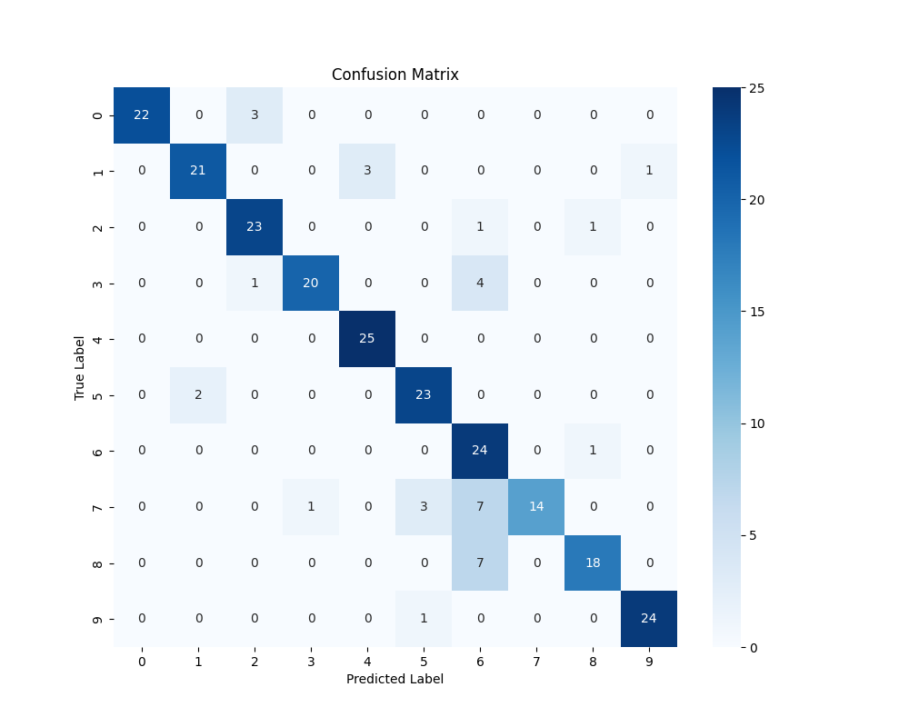

# LLM Coding Challenge: Spoken Digit Classification

This project is a submission for the LLM Coding Challenge. It's a lightweight prototype that classifies spoken digits (0–9) from audio input in real time. The entire project, from initial scaffolding to the final interactive GUI, was built in a few hours with the close collaboration of an LLM coding assistant( Gemini and Copilot).

---

## Key Results

The model achieves a strong baseline performance, demonstrating the effectiveness of the chosen architecture. The lightweight nature of the model ensures it is highly responsive, with an average inference time of less than a millisecond on a CPU.

| Metric                      | Value   |
| --------------------------- | ------- |
| **Final Test Accuracy** | **85.6%** |
| **Avg. Inference Time (CPU)** | **0.77 ms** |

### Confusion Matrix

The confusion matrix below shows the model's performance on each digit. The diagonal represents correct predictions. The off-diagonal values highlight areas for future improvement (e.g., the model occasionally confuses '3' and '5', and '7' and '8').




---

## Live Demo

The final application provides a user-friendly interface for real-time digit classification, complete with live audio visualization and prediction confidence plots.

*(Here you would insert an animated GIF of your final GUI application in action. You can use a tool like Giphy Capture or ScreenToGif to record your screen.)*

---

## LLM Collaboration Showcase

A core part of this challenge was demonstrating effective collaboration with an LLM. Throughout this project, the LLM was used not as a code generator, but as an interactive "pair programmer" and technical consultant.

My workflow followed a distinct pattern:

1. **Deep Research and Strategy Formulation**: The project began with a deep research phase where the LLM was prompted to analyze the problem description and generate a comprehensive technical guide. This document served as a complete blueprint for the project, providing a deep understanding of the FSDD dataset, justifying key architectural decisions (like choosing Mel Spectrograms over MFCCs), and outlining strategies for model improvement and real-time integration. This foundational research provided all the resources needed to complete the project and allowed for a rapid, end-to-end development process built on a solid, pre-validated strategy. 

2.  **Scaffolding**: Initial prompts were high-level, asking the LLM to generate the boilerplate code for the project structure, including the PyTorch `Dataset` class, the `nn.Module` for the model, and the basic training loop.
3.  **Iterative Debugging**: This was the most critical phase. When encountering errors (`ModuleNotFoundError`, `RuntimeError`, `AttributeError`), the full traceback was provided to the LLM. This allowed the LLM to analyze the context and provide precise fixes, such as correcting dependency lists, fixing tensor shape mismatches in the model's linear layer, and refactoring the data loading logic to be more robust.
4.  **Architectural Reasoning**: We used the LLM to reason about design choices. For example, we discussed the pros and cons of different data loading strategies (`datasets` library vs. `torchaudio` vs. direct download) to overcome persistent library versioning issues, ultimately settling on the most stable approach. The final, robust "trigger and capture" logic in the GUI was developed through this iterative dialogue.

---

## Architecture and Methodology

### Modeling Choices

* **Audio Features**: We chose **Mel Spectrograms** as the input for our model. This 2D time-frequency representation is ideal for a CNN because it preserves the spatial relationships in the audio, much like an image. This choice is more effective than raw 1D audio (which would require a more complex model) and less lossy than highly compressed features like MFCCs.
* **Model Type**: The core of the project is a **lightweight 2D Convolutional Neural Network (CNN)**. This architecture was chosen for its efficiency and proven effectiveness in image-like pattern recognition. For classifying short, isolated words, a CNN is significantly faster and less computationally demanding than a sequential model like an RNN or LSTM.

### Model Performance and Fortification

* **Metrics**: Performance was measured using **accuracy**, a **confusion matrix**, and **average inference time**. This provides a comprehensive view of the model's overall correctness, specific weaknesses, and real-world responsiveness.
* **Creative Energy**: To improve robustness, the model was trained with **SpecAugment**, a modern data augmentation technique that randomly masks parts of the Mel spectrogram. This forces the model to learn more general features and improves its ability to handle variations in speech, satisfying the "Creative energy" criterion.

### Code Architecture

The project is organized into a clean, modular structure to promote readability and extensibility.

* `src/`: Contains the core machine learning pipeline.
    * `preprocess.py`: Functions for audio standardization and feature extraction.
    * `data_loader.py`: The PyTorch `Dataset` class for loading and preparing data.
    * `model.py`: The `LightweightCNN` model definition.
    * `train.py`: The main script for training and evaluating the model.
* `app/`: Contains the user-facing application.
    * `gui_app.py`: The final interactive GUI for real-time prediction.
* `config.yaml`: A central configuration file for all hyperparameters, preventing hard-coded values and making experimentation easy.

---

## Bonus: Microphone Integration

The optional challenge was fully completed by building a functional, real-time GUI application (`app/gui_app.py`). This demonstrates a broader set of engineering skills beyond offline model training.

Key features that address real-world challenges include:

* **Live Audio Visualization**: The user can see the audio waveform in real time, providing immediate feedback that the microphone is working.
* **Interactive Device Selection**: A dropdown menu allows the user to select the correct microphone from a list of available devices, solving a common hardware compatibility issue.
* **Robust Prediction Logic**: The final "trigger and capture" logic ensures that the model only predicts on a complete, clean audio clip, preventing false positives from background noise.
* **Debugging Tools**: The "Play Last 5 Seconds" feature was a critical debugging tool that allowed us to diagnose issues with the audio capture logic and improve the application's reliability.

---

## Setup and Usage

### 1. Installation

First, clone the repository and install the required dependencies into a virtual environment.

```bash
git clone <your-repo-url>
cd <your-repo-name>
python -m venv venv
source venv/bin/activate  # On Windows, use `venv\Scripts\activate`
pip install -r requirements.txt
